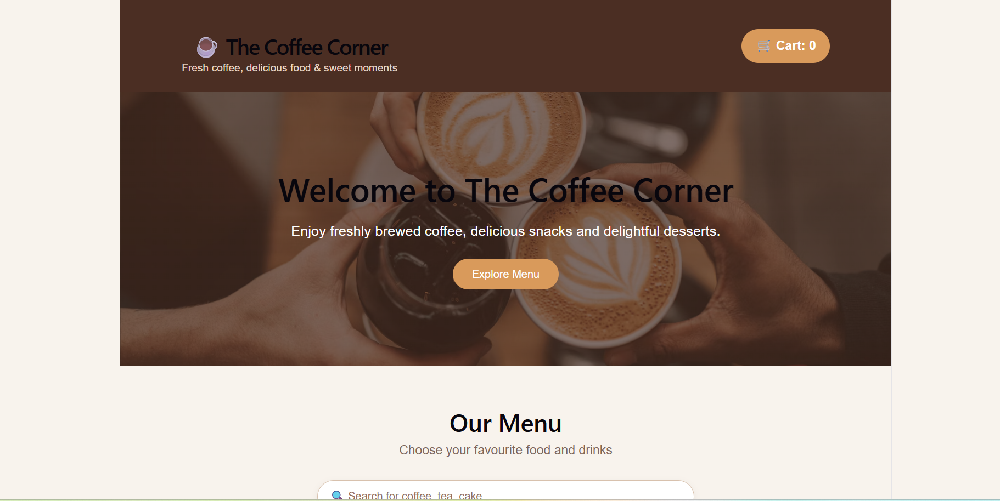
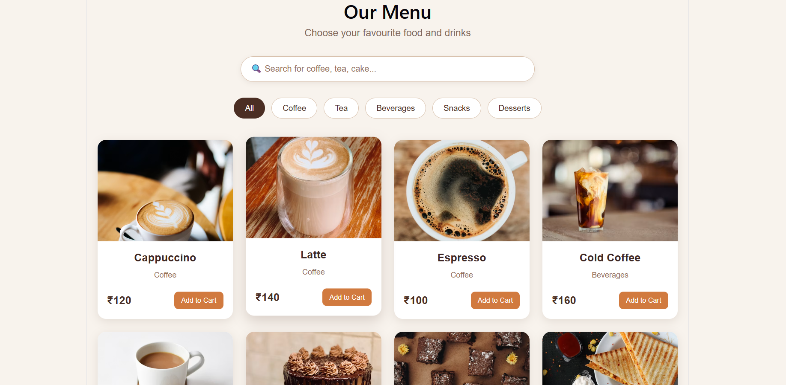
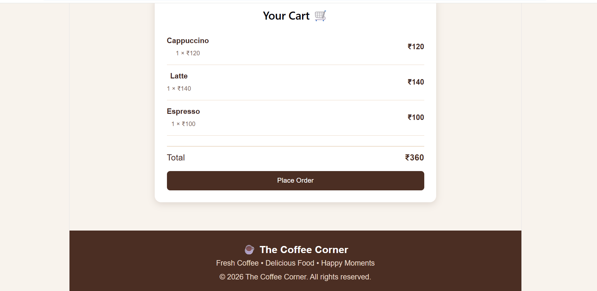

# ☕ The Coffee Corner

> A full-stack café ordering web application built with React.js, Vite, Node.js, Express.js, and MongoDB. Customers can browse the café menu, search for items, manage quantities, enter their details, and place orders that are stored in MongoDB.

---

## 📷 Project Screenshots

### 🏠 Home Page



### ☕ Menu Page



### 🛒 Cart Page



### 👤 Customer Details


### 🧾 Order Summary


---

## 📖 Executive Overview

**The Coffee Corner** is a full-stack café ordering application designed to simplify the process of placing and storing customer orders.

The application uses a modern **React.js frontend** connected to a **Node.js and Express.js backend**. Customer orders are sent through REST APIs and stored in **MongoDB**.

The project demonstrates a complete full-stack workflow:

```text
Customer
   ↓
React.js Frontend
   ↓
Express.js REST API
   ↓
Node.js Backend
   ↓
MongoDB
   ↓
Order Stored Successfully
1. Customer opens The Coffee Corner
              ↓
2. Browses the café menu
              ↓
3. Searches for menu items
              ↓
4. Adds items to the cart
              ↓
5. Adjusts item quantities
              ↓
6. Enters customer details
              ↓
7. Selects table number
              ↓
8. Clicks "Place Order"
              ↓
9. React sends POST request
              ↓
10. Express receives the order
              ↓
11. Order is saved in MongoDB
              ↓
12. Backend returns successful response
              ↓
13. React displays Order Confirmation
                   ┌─────────────────────────────┐
                   │       React.js Frontend     │
                   │        Vite Application     │
                   │                             │
                   │  Menu • Search • Cart       │
                   │  Customer Details           │
                   │  Order Confirmation         │
                   └──────────────┬──────────────┘
                                  │
                              HTTP / REST
                                  │
                   ┌──────────────▼──────────────┐
                   │      Node.js + Express      │
                   │        Backend API          │
                   │                             │
                   │  Order Routes               │
                   │  Request Handling           │
                   │  MongoDB Integration        │
                   └──────────────┬──────────────┘
                                  │
                              Mongoose
                                  │
                   ┌──────────────▼──────────────┐
                   │           MongoDB           │
                   │                             │
                   │       Orders Collection     │
                   └─────────────────────────────┘
                   {
  "customerName": "Shreya",
  "phone": "9876510106",
  "tableNumber": 2,
  "items": [
    {
      "name": "Cappuccino",
      "quantity": 1,
      "price": 120
    },
    {
      "name": "Veg Sandwich",
      "quantity": 1,
      "price": 130
    }
  ],
  "total": 250
}
{
  "customerName": "Shreya",
  "phone": "9876510106",
  "tableNumber": 2,
  "items": [
    {
      "name": "Cappuccino",
      "quantity": 1,
      "price": 120
    },
    {
      "name": "Veg Sandwich",
      "quantity": 1,
      "price": 130
    }
  ],
  "total": 250
}
cafe-menu-app/
│
├── public/
│
├── Screenshots/
│   ├── Cart.pge.png
│   ├── Customer details.pge.png
│   ├── Home.pge.png
│   ├── Menu.pge.png
│   └── order summary.pgn.png
│
├── src/
│   ├── assets/
│   ├── App.jsx
│   ├── App.css
│   └── main.jsx
│
├── server/
│   ├── config/
│   │   └── db.js
│   │
│   ├── models/
│   │   └── Order.js
│   │
│   ├── routes/
│   │   └── orderRoutes.js
│   │
│   ├── db.js
│   ├── server.js
│   ├── package.json
│   └── package-lock.json
│
├── .gitignore
├── index.html
├── package.json
├── package-lock.json
├── vite.config.js
└── README.md
🚀 Installation and Setup
1. Clone the Repository
git clone https://github.com/shreya60-cell/cafe-menu-app.git
2. Open the Project
cd cafe-menu-app
3. Install Frontend Dependencies
npm install
4. Install Backend Dependencies
cd server
npm install
5. Configure Environment Variables

Create a .env file inside the server folder.

Example:

PORT=5000
MONGO_URI=your_mongodb_connection_string

Do not upload the .env file to GitHub.

6. Start the Backend

From the server folder:

node server.js

The backend will run on:

http://localhost:5000

You should see:

☕ Coffee Corner server running on http://localhost:5000
✅ MongoDB connected successfully!
7. Start the Frontend

Open another terminal and return to the project root:

cd ..
npm run dev

Vite will provide the frontend URL, usually:

http://localhost:5173

If port 5173 is already in use, Vite may automatically use another port such as:

http://localhost:5174
⚙️ Environment Variables

The backend uses environment variables to protect configuration details.

Example:

PORT=5000
MONGO_URI=your_mongodb_connection_string

The .env file is excluded from Git using .gitignore.

🧪 Testing

The backend and database integration were tested successfully.

Backend Test
GET /api/test

Result:

{
  "message": "Order API is working!"
}
Order Creation Test

A test order was successfully submitted through the API.

Example:

Customer: Shreya
Table: 2
Cappuccino: ₹120
Veg Sandwich: ₹130
Total: ₹250
MongoDB Verification

Orders were successfully retrieved from MongoDB using:

GET /api/orders

A real frontend order was also successfully tested:

Customer: rrrrrr
Table: 5
Chocolate Cake: ₹180
Brownie: ₹150
Total: ₹330

This confirms the complete workflow:

React
  ↓
Express API
  ↓
MongoDB
  ↓
Order Retrieved Successfully
🔒 Security Considerations
MongoDB connection details are stored in .env.
.env is excluded using .gitignore.
node_modules is excluded from version control.
Backend and frontend are separated.
Orders are processed through REST APIs instead of directly connecting the frontend to MongoDB.
Database credentials are not stored in the source code.
🚧 Current Limitations

The current version focuses on the core café ordering workflow.

Possible future additions include:

Admin dashboard
Order status management
Online payment integration
User authentication
Customer order history
Inventory management
Menu management
Order notifications
Printable bills
Sales analytics
Daily/monthly revenue reports
🔮 Future Improvements
👨‍💼 Admin Dashboard

Allow café staff to view and manage incoming orders.

📊 Sales Analytics

Display:

Daily sales
Monthly sales
Popular menu items
Number of orders
Revenue statistics
💳 Online Payments

Integrate a secure payment gateway for online order payments.

📱 Responsive Design

Improve the interface for:

Mobile phones
Tablets
Desktop computers
🔐 Authentication

Add secure login functionality for café administrators.

📜 License

This project is created for educational and portfolio purposes.

You are free to modify and improve the project for learning and development.

👩‍💻 Author

Shreya L

BCA Graduate | Aspiring IT Professional

Project

The Coffee Corner

A full-stack café ordering application demonstrating frontend development, REST API integration, backend development, and MongoDB database management.

⭐ Project Highlights
☕ React.js Frontend
🟢 Node.js + Express Backend
🍃 MongoDB Database
🔌 REST API
🛒 Online Café Ordering
🔍 Menu Search
➕➖ Quantity Management
🛍️ Shopping Cart
👤 Customer Details
📦 Order Management
✅ Order Confirmation
💾 Persistent Database Storage
🐙 GitHub Version Control
⭐ Project Status

Completed and tested successfully.